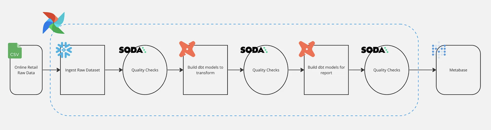

# Retail Stream Analytics: Modern Data Pipeline

## Overview

This repository demonstrates a real-time analytics pipeline for retail data, orchestrated with Apache Airflow and leveraging Google Cloud Pub/Sub, BigQuery, dbt, Soda, and Metabase. The pipeline ingests streaming sales data, applies transformations, enforces data quality, and visualizes insights.

---

## Features

- **Real-Time Ingestion:**  
  Streams sales events from GCP Pub/Sub into BigQuery.

- **Orchestrated Workflows:**  
  Airflow DAGs manage ingestion, transformation, and quality checks.

- **Data Quality Assurance:**  
  Soda checks run after each stage to ensure data integrity.

- **Transformations with dbt:**  
  dbt models clean, aggregate, and join data for reporting.

- **Business Intelligence:**  
  Metabase dashboards provide actionable insights for retail operations.

---

## Architecture

 

---

## Environment Setup

- **Astro CLI** for Airflow orchestration
- **GCP Pub/Sub** for streaming ingestion
- **BigQuery** as the data warehouse
- **dbt** for SQL-based transformations
- **Soda** for data quality checks
- **Metabase** for BI dashboards

### Docker Images

- Astro Runtime: `quay.io/astronomer/astro-runtime:8.8.0`
- Soda Core BigQuery: `soda-core-bigquery==3.0.45`
- dbt BigQuery: `dbt-bigquery==1.5.3`
- Metabase: `metabase/metabase:latest`  
  **Note:** _Always use the latest Metabase image to avoid security vulnerabilities._

---

## Quickstart

1. **Clone the repo**
git clone https://github.com/your-username/retail-stream-analytics.git
cd retail-stream-analytics
text

2. **Configure GCP credentials**
- Place your `service_account.json` in `include/gcp/`.

3. **Start the environment**
astro dev start
text

4. **Publish sample events**
- Use the provided Python script in `scripts/publish_events.py` to send test data to Pub/Sub.

5. **Run Airflow DAGs**
- Trigger the `streaming_ingest` and `batch_transform` DAGs from the Airflow UI.

6. **View dashboards**
- Access Metabase at [http://localhost:3000](http://localhost:3000).

---

## Security Notice

> **Always use the latest Metabase image.**  
> The screenshot below (from Docker Desktop) shows critical vulnerabilities in older Metabase images.  
> 

---

## Credits

Inspired by [azizbohra17/Airflow-End-to-End-Pipeline](https://github.com/azizbohra17/Airflow-End-to-End-Pipeline) and [chayansraj/Data-Pipeline-with-dbt-using-Airflow-on-GCP](https://github.com/chayansraj/Data-Pipeline-with-dbt-using-Airflow-on-GCP), with a focus on streaming data and real-time analytics.

---

## License

MIT

---
